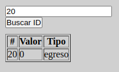
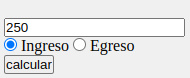
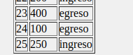
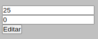
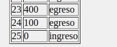
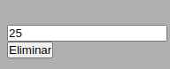
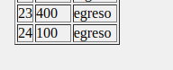
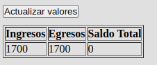

# Presupuesto de una Casa

**Autor:**

- Kevin Johan Jimenez Delgado

## Descripción del Proyecto

Este proyecto permite administrar un presupuesto de una casa a través de la capacidad de consumir una API mediante MockApi. Las principales funcionalidades incluyen la búsqueda, creación, edición, eliminación y actualización de registros por medio de una ID. Además, se muestra el total de los ingresos y egresos.

## Tecnologías Utilizadas

- HTML
- CSS
- JavaScript
- MockApi `https://6509e7e7f6553137159c3ae5.mockapi.io/presupuestoCasa`
- Métodos como PUSH, DELETE, POST
- Eventos de escucha como addEventListener

## Instrucciones de Uso

1. Abre el archivo `index.html` en tu navegador para visualizar el proyecto.

2. Para realizar acciones en el presupuesto de la casa, utiliza las siguientes funcionalidades:

   - **Buscar ID:** Ingresa una ID en el formulario de búsqueda y haz clic en "Buscar ID" para encontrar registros existentes.

   

   - **Crear Registro:** Completa el formulario con un monto, selecciona el tipo (Ingreso o Egreso) y haz clic en "Calcular" para agregar un nuevo registro.

   

   Recuerda actualizar para ver estos valores en la página web

   

   - **Editar Registro:** En el formulario de edición, ingresa la ID que deseas editar y el nuevo valor (monto). Luego, haz clic en "Editar" para actualizar la ID con el nuevo valor.

   

   

   - **Eliminar Registro:** En el formulario de eliminación, ingresa la ID que deseas eliminar y haz clic en "Eliminar" para eliminar el registro correspondiente.

   

   

   - **Actualizar Valores:** Utiliza el botón "Actualizar Valores" para reflejar los cambios en la página después de realizar acciones de creación, edición o eliminación de registros. La información que se mostrará es el saldo a favor o el saldo en contra dependiendo de la sumatoria de los ingresos o los egresos

   

## NOTA

- **Actualizar Valores:** Utiliza el botón "Actualizar Valores" para reflejar los cambios en la página después de realizar acciones de creación, edición o eliminación de registros.

- **Ver proyecto:** Abrir con ver en vivo u open with live server